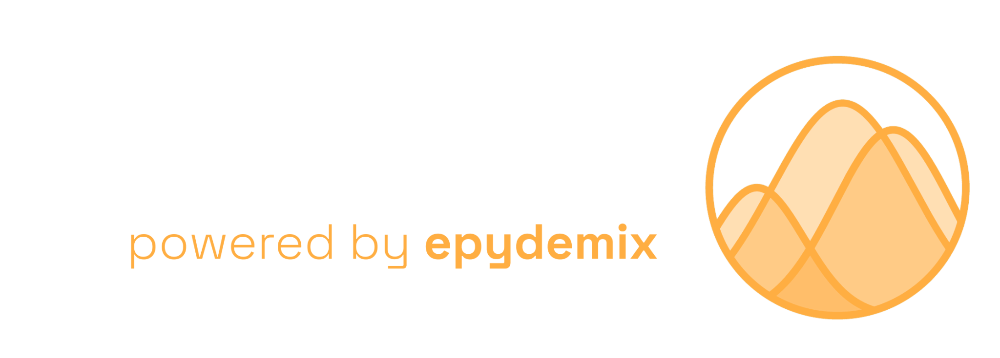

<p align="center">
  
</p>

<p align="center">
  <a href="https://scenario.epydemix.org/"></a>
</p>

## Overview

**EpyScenario** is an interactive platform for exploring epidemic scenarios using age-structured compartmental models. Built on [Epydemix](https://epydemix.org), it enables scenario comparison with realistic contact patterns for 400+ geographies.

Try it now: [scenario.epydemix.org](https://scenario.epydemix.org/)

## Features

- **Epidemic Models**: SEIR (measles), SEIRS with seasonality (influenza), SEIHR with hospitalization (COVID-19)
- **Contact Interventions**: Model NPIs like school closures, work-from-home, and social distancing across home, school, work, and community settings
- **Vaccination Campaigns**: Age-targeted vaccination with configurable efficacy, coverage, and rollout shapes
- **Scenario Comparison**: Run and compare multiple scenarios side-by-side
- **Real-World Data**: Contact matrices for 400+ geographies with age-specific mixing patterns

## Installation

To run the dashboard locally:

1. **Clone the repository:**
    ```bash
    git clone https://github.com/ngozzi/epydemix-dashboard.git
    cd epydemix-dashboard
    ```
2. **(Optional) Set up a Python virtual environment:**
    ```bash
    python3 -m venv venv
    source venv/bin/activate
    ```
3. **Install dependencies:**
    ```bash
    pip install -r requirements.txt
    ```

## Usage

Launch the dashboard locally:
```bash
streamlit run Dashboard.py
```

## Live Demo

Try the live version at [scenario.epydemix.org](https://scenario.epydemix.org/)

## Contributing

Contributions are welcome! You can:

- Open an [issue](https://github.com/ngozzi/epydemix-dashboard/issues) to report bugs or suggest features
- Submit a [pull request](https://github.com/ngozzi/epydemix-dashboard/pulls) with improvements
- Fork and adapt for your own simulation models

## License

This project is licensed under the [GNU General Public License v3.0](https://www.gnu.org/licenses/gpl-3.0.html).

## Contact

Questions, feedback, or support requests?  
Open an [issue](https://github.com/ngozzi/epydemix-dashboard/issues) or contact [@ngozzi](https://github.com/ngozzi).
