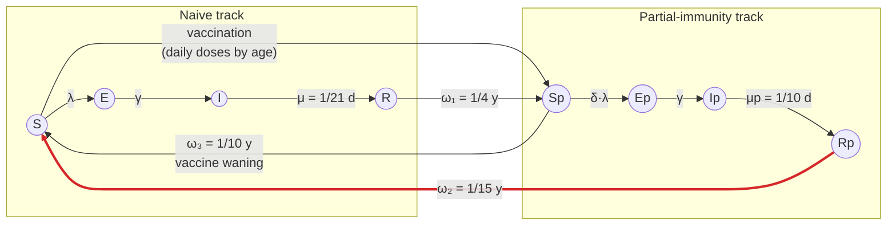

# Pertussis model structure (`run_pertussis_stub`)

8-compartment SEIRS with a parallel partial-immunity track, after
Wearing & Rohani (2009). Age-structured through the five contact-matrix bands
`0-4, 5-19, 20-49, 50-64, 65+`. Closed population — no births, deaths or aging.



Force of infection, shared by both tracks:

```
λ(t) = β(t) · ( I + σ·Ip )
```

applied at full strength to `S` and reduced by `δ` to `Sp`. `β(t)` carries the
seasonality factor. R₀ is defined on the naive track (`β / μ`).

## Parameters

| symbol | key | default | meaning |
|---|---|---|---|
| R₀ | `R0` | 12.0 | naive-track basic reproduction number |
| 1/γ | `incubation_period` | 9 d | latent period, both tracks |
| 1/μ | `infectious_period` | 21 d | infectious period, naive |
| 1/μₚ | `infectious_period_partial` | 10 d | infectious period, partial (milder, shorter) |
| σ | `rel_infectiousness_partial` | 0.20 | relative infectiousness of `Ip` |
| δ | `rel_susceptibility_partial` | 0.30 | relative susceptibility of `Sp` |
| ω₁ | `waning_full_to_partial_years` | 4 y | `R → Sp`, post-infection |
| ω₂ | `waning_partial_to_susceptible_years` | 15 y | `Rp → S`, post-infection |
| **ω₃** | **`waning_vaccine_to_susceptible_years`** | **10 y** | **`Sp → S`, vaccine-derived** |

## Why ω₃ exists

Before it, `Sp` had exactly one exit: infection (`Sp → Ep`). Both existing
waning transitions start from a *recovered* state, so vaccine-derived
protection had no decay path at all — a child who completed DTaP and avoided
infection sat at δ = 0.3 indefinitely.

That is the wrong place for a gap in a pertussis model. DTaP protection wanes
materially within 5–10 years of the primary series; it is the documented driver
of adolescent resurgence and the rationale for the 11-year Tdap booster. Oregon
2023 cases bear this out — the 5–19 band held 22 of 40 cases (55%).

ω₃ also closes the `S ⇄ Sp` loop: vaccination moves individuals one way, waning
returns them, without requiring an intervening infection.

Set ω₃ to its maximum (50 y) to approximate the previous no-vaccine-waning
behaviour. The default of 10 y is active, so results differ from runs made
before ω₃ was added.

## What ω₃ does not fix

`scripts/sensitivity_waning.py` sweeps it. Burden responds strongly — 2.1× more
cases at ω₃ = 3 y than at 50 y — but the **age distribution moves the wrong
way**: the 5–19 share falls from 0.251 to 0.212 as waning accelerates, against
an observed 0.550.

The reason is structural. ω₃ is a single per-capita rate applied to `Sp` in
every band, so faster waning adds most susceptibles to the largest band
(20–49, which the model already puts at 0.42 against an observed 0.025).
Uniform waning cannot produce an age-specific susceptibility peak.

Reproducing the adolescent signal requires waning on *time since vaccination*,
and "10 years after the 4–6 y dose" is not representable without cohort
structure — i.e. the aging/demography work in
[`pertussis-age-cohort-scope.md`](pertussis-age-cohort-scope.md). ω₃ is a
prerequisite for that, not a substitute.

Separately: at default settings the model produces a 37–77% three-year attack
rate, an epidemic rather than endemic regime. Comparisons against Oregon's
endemic 2023 distribution are therefore not like-for-like.
